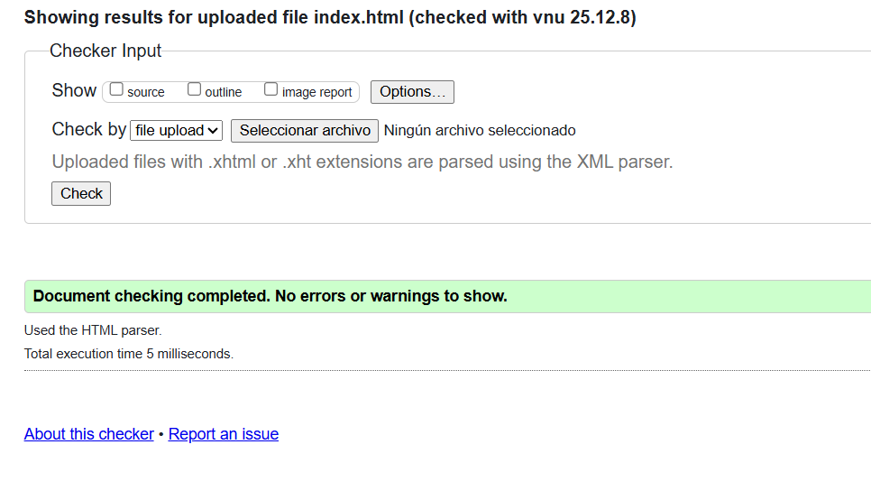
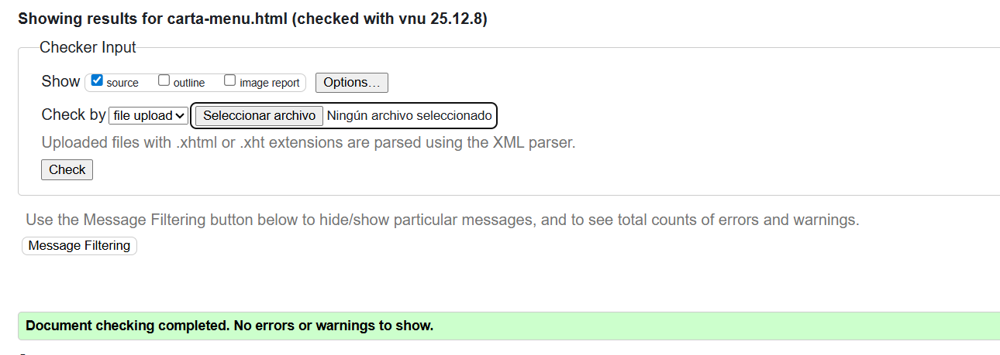
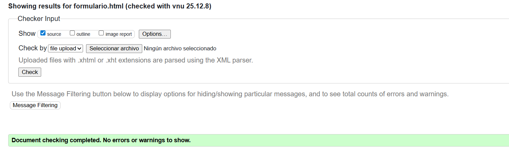
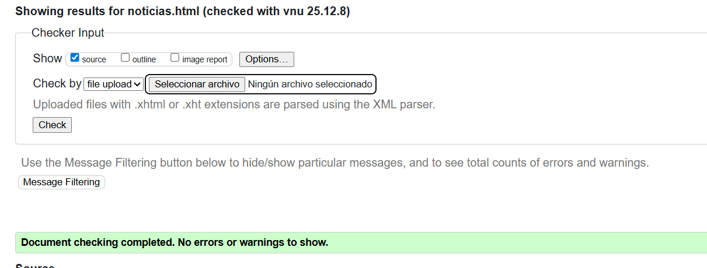
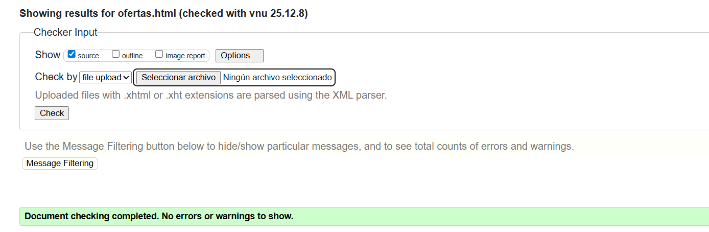
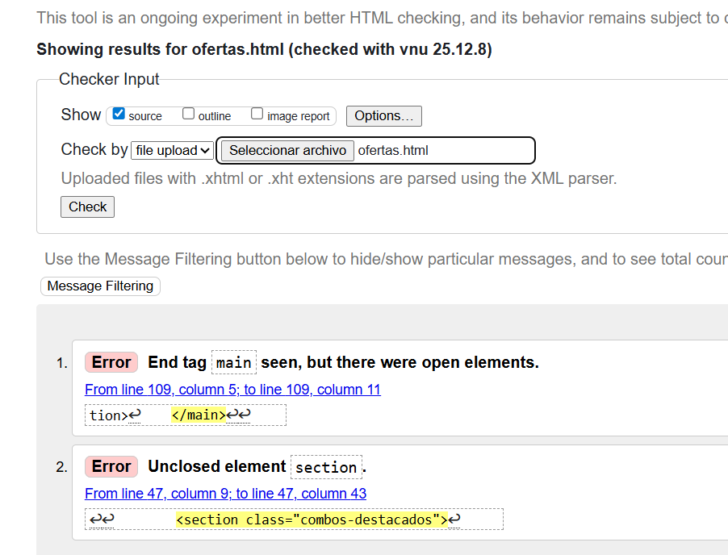
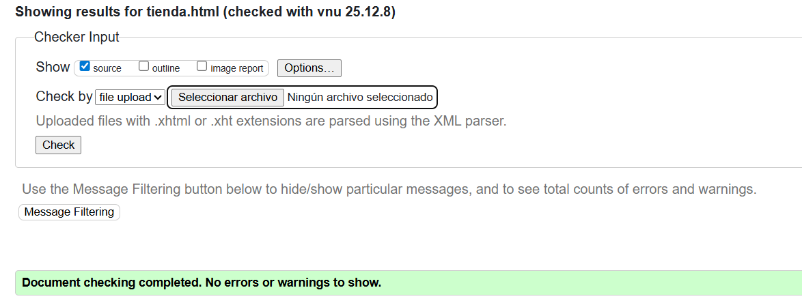
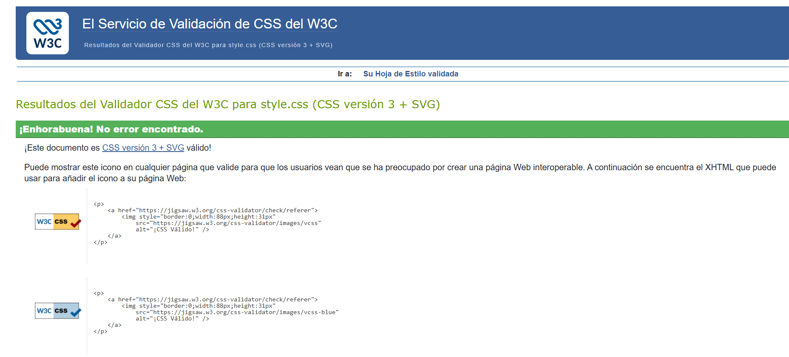

# Proyecto_Tienda_Kebab

Para este proyecto he escogido ser el encargado de crear una pagina web con HTML5 y CSS3 para un KEBAB.

## Idea y desarrollo
- La idea surgió porque siempre se suelen hacer las mismas páginas web, ya sean tiendas, blogs, noticias o eventos y quería innovar un poco con un tema como son los restaurantes.

- Para poder plasmar mis ideas en la página hago uso de diferentes lenguajes de marcas como HTML5 y Markdown y posteriormente CSS3.

---

## HTML5

HTML5 es la versión más reciente del lenguaje de marcas **HTML** que usamos para estructurar el contenido en la web.  
Permite crear páginas web más organizadas, accesibles y compatibles con dispositivos modernos.  
El proyecto incluye nuevas etiquetas semánticas como `<header>`, `<nav>`, `<section>`, `<footer>` y formularios mejorados.

- **Estructura clara:**  
  EL proycecto tiene etiquetas semánticas para organizar la página, por ejemplo:  
  - `<header>` para el logo y menú de navegación.  
  - `<section>` para el menú de kebabs.  
  - `<article>` para cada tipo de kebab con descripción y precio.  
  - `<footer>` con información de contacto y redes sociales.

  A todo esto se le añade el uso de `h1` - `h6` para tener los encabezados y el tipo de letra correctamente situado.

- **Multimedia:**  
  Incluye imágenes con `` para atraer clientes y que puedan ver que se hace en el restaurante.

- **Formulario:**  
  Añade un formulario para poder registrarse dentro de la web y ser cliente exclusivo utilizando `<form>`, `<input>`, y `<button>`.

- **Accesibilidad:**  
  Mejora la experiencia de usuarios con etiquetas y atributos adecuados, como por ejemplo reduciendo el uso de la eqtiqueta ´div´ para utilizar correctamente las etiquetas ´article´ y ´section´.
  
- **Blog:**
  Contiene ofertas y promociones de la tienda utilizando `<article>` y `<section>` para agruparlas por categorías.

---

## Decisiones y contenido de cada página 
He considerado que estas 6 páginas pueden darle a la web mucho juego a la hora de poder sacarle partido a las diferentes ideas y así poder tener un diseño de la página muy visual y llamativo.

- **index.html:**  
  Página principal del proyecto.  
 - Incluye información importante como los **productos destacados** y **ofertas del mes**.

- **carta-menu.html:**  
  Incluye todo el menú del restaurante e **incluye fotos de cada plato**.

- **tienda.html:**  
  Página encargada de vender **nuestros propios productos** al cliente y recomendándole técnicas de elaboración.

- **noticias.html:**  
  Página con información completa sobre el restaurante.  
  - Explica **por qué abrió el local** y **cómo se elaboran los platos**, incluyendo el **origen del kebab o shawarma**, un **menú de reseñas** y nuestro conocido **reto de comida**.

- **formulario.html:**  
  Permite **realizar pedidos** a través de un formulario, ofreciendo una experiencia diferente al formulario de registro para hacerlo más **realista y funcional**.

- **ofertas.html:**  
  Lugar donde se pueden ver las **ofertas del local**, incluyendo las **ofertas del mes**, que se actualizan **el primer día de cada mes**.  
  - Esta página sirve para mantener la web dinámica e interesante para los clientes habituales.

---

## CSS
### Estructura principal

## 1. Organización del Archivo

El código sigue un orden lógico descendente para asegurar que los estilos base se carguen antes que las especificaciones:

- **Configuración Inicial**
  - Declaración de variables  
  - Importaciones  
  - Reset de estilos  
  - Elementos comunes  

- **Componentes Globales**
  - Estilos para la cabecera (`header`)  
  - Estilos para el pie de página (`footer`)  

- **Secciones Específicas**
  - Cada sección está identificada con el nombre del archivo HTML correspondiente para localizar el código rápidamente  

- **Adaptabilidad**
  - Todo lo relacionado con el diseño responsivo se encuentra agrupado al final del documento  

---

## 2. Identidad Visual y Tipográfica

| Elemento         | Selección         | Justificación                                                                 |
|------------------|------------------|------------------------------------------------------------------------------|
| Tipografía       | Georgia           | Fuente clara y de tamaño moderado; ideal para la lectura de una carta.     |
| Color Primario   | Rojo fuerte       | Aporta potencia visual y presencia.                                         |
| Color Secundario | Amarillo potente  | Contraste vibrante que evita los tópicos del sector (verde/negro).         |

---

## 3. Metodología y Mantenimiento

**Objetivo:** Mantener todo el estilo en una sola hoja para garantizar una separación clara entre estructura (HTML) y diseño (CSS), facilitando la implementación futura de JavaScript.

### Ventajas del sistema utilizado

- **Variables Permanentes**  
  El uso de valores inmutables permite trabajar de forma más ordenada.

- **Consistencia Visual**  
  Asegura que las animaciones, tamaños y colores sean idénticos en toda la web.

- **Control de Errores**  
  Facilita la detección de fallos y evita que partes de la web queden desactualizadas tras un cambio.

---

## 4. Enfoque del Proyecto

El diseño es el resultado de una búsqueda perfeccionista por una estética propia, aplicando tanto los conocimientos del curso anterior como nuevas implementaciones investigadas para lograr una web más completa.

## Validación HTML Y CSS

### index.html

### carta-menu.html

### formulario.html

### noticias.html

### ofertas.html

**No tenía cerrada una sección, fallo solucionado.**

### tienda.html

## style.css

---

## JavaScript
El proyecto se sigue actualizando y "*Kebab Amigo*" contendrá un nivel básico de JavaScript para poder empezar a ver la verdadera importancia de maquetar bien y tener todo el código ordenado.

**¿Qué son los lenguajes Script?**

Los lenguajes de script son lenguajes de programación diseñados para automatizar tareas que normalmente requieren intervención manual. Estos lenguajes suelen ser más fáciles de escribir y entender en comparación con lenguajes de programación tradicionales como C++ o Java. A menudo se utilizan para el procesamiento de texto, manipulación de archivos, administración de sistemas y desarrollo web. 

### Lenguajes script, función de ejecución y uso en desarrollo web.

En este proyecto, tendremos encuenta los lenguajes de script de cliente y estas son sus principales características

- **Lenguajes de script del lado del cliente**
  - Se ejecutan en el navegador del usuario.
  - No requieren comunicación con el servidor para su ejecución.
  - Mejoran la interactividad y la experiencia del usuario.
  - Ejemplos: JavaScript, TypeScript, Dart.

**Características Principales de JavaScript**

  En el proyecto vamos a trabajar con JavaScript por lo que es importante saber cuales son sus características más relevantes:

  - **Interpretado**: No necesita compilación, el navegador lo ejecuta directamente.
  - **Orientado a eventos**: Responde a interacciones del usuario (clics, teclas, etc.).
  - **Débilmente tipado**: No es necesario definir el tipo de las variables.
  - **Multiparadigma**: Soporta programación funcional, orientada a objetos y basada en eventos.
  - **Extensible**: Se integra con HTML y CSS, además de otras APIs web.

**Identificación de ECMAScript y sus versiones relevantes.**

ECMAScript es el estándar en el que se basa JavaScript y estas son Algunas de sus versiones más importantes y el año en el que salieron:
- **ES5 (2009**): Introdujo JSON nativo y mejoras en Arrays.
- **ES6 (2015)**: Incorporó let, const, funciones flecha, clases y Promise.
- **ES7 - ESNext (2016 en adelante)**: Añadió async/await, operadores de propagación y más mejoras.

**Comparación entre lenguajes de script como JavaScript, TypeScript u otros.**

Ya que en el trabajo usaremos JavaScript, voy hacer una pequeña comparación de JavaScript, TypeScript y de Dart en forma de tabla (he buscado como se hacía para que la explicación quedase mucho más legible) para ver las ventajas y desventajas de cada uno y sus características principales.

| **Característica**     | **JavaScript**                                            | **TypeScript**                                                      | **Dart**                                                  |
|------------------------|-----------------------------------------------------------|---------------------------------------------------------------------|-----------------------------------------------------------|
| **Tipado**             | Dinámico, no requiere declarar tipos.                    | Estático, con tipado explícito, aunque puede inferirse en muchos casos. | Estático, con tipos obligatorios para variables y funciones. |
| **Compilación**        | No requiere compilación, ejecutado directamente en el navegador. | Se compila a JavaScript antes de ejecutarse en el navegador.       | Se compila a código nativo o a JavaScript (para aplicaciones web). |
| **Paradigma**          | Multiparadigma (funcional, orientado a objetos, etc.).    | Orientado a objetos con un enfoque más fuerte en clases e interfaces. | Orientado a objetos, muy estructurado. |
| **Facilidad de uso**   | Fácil de aprender y usar.                                 | Requiere aprender un sistema de tipos estáticos, pero útil en proyectos grandes. | Relativamente fácil de aprender, con un enfoque más fuerte en la organización del código. |
| **Popularidad**        | Muy popular, estándar para desarrollo web.               | Popular en grandes proyectos, especialmente con Angular.            | Popularidad en crecimiento, especialmente con el uso de Flutter para apps móviles. |
| **Herramientas**       | Amplio ecosistema (React, Node.js, etc.).                | Mejor soporte en proyectos grandes gracias a su tipado estático.     | Se usa principalmente con Flutter para desarrollo móvil y web. |

**Uso de ejemplos o referencias para justificar la clasificación.**

La aplicación más sencilla de ver es que se puede ejecutar directamente en el navegador, eliminando el paso de transpilación necesario en TypeScript.

